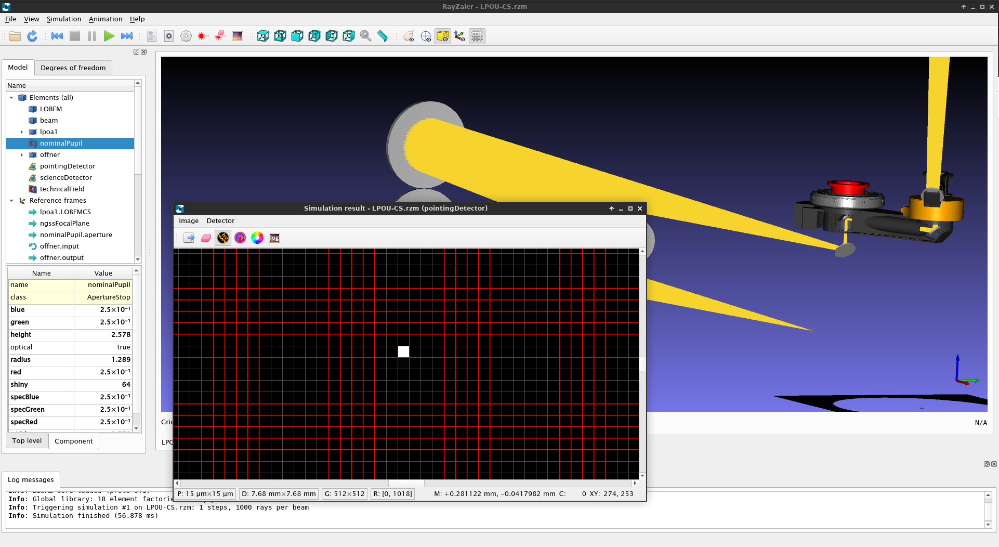

# RayZaler
A free-as-in-freedom opto-mechanical simulation framework.

## Build instructions
* [Build & install](doc/install.md)

## Getting started
* [Getting started with the Python API](doc/gettingstarted.md)

