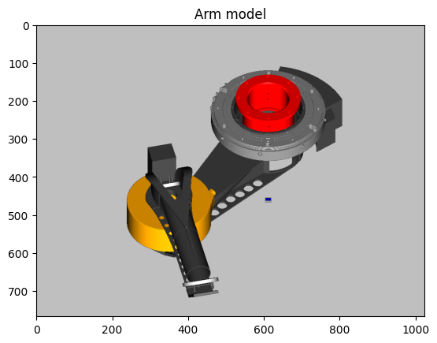
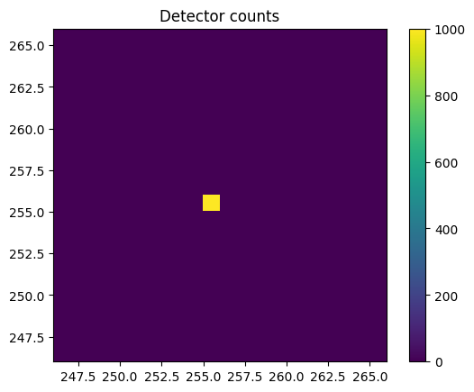

# Getting started (Python 3 API)

The main RayZaler use case is from Python 3 scripts that load model files, adjust degrees of freedom, trigger simulations and retrieve results. This is achieved by means of RayZaler’s Python API. In this section, we illustrate the typical usage of the RayZaler API with a real world example: a provisional model of a component of HARMONI’s Low Order Wavefront Sensor Subsystem (LOWFS), called LOWFS Pickoff Unit (LPOU). The full model [can be downloaded from here](https://github.com/HARMONI-CAB/LPOU) and it is splitted into several files by means of file imports.

Among other functions, the LPOU provides secondary guiding capabilities to HARMONI for improved image quality. The LPOU consists of two guide probes named LOWFS Pickoff Arms (LPOA), of which only one is currently modeled
(LPOA1). The LPOA1 is modeled as a composite element and consists of two articulated periscopes in a shoulder-elbow
configuration that forwards the light from its tip to a secondary guiding sensor. In this model, the guiding sensor is
provisionally modeled as an Offner relay attached to a Detector element (named `pointingDetector`).

The LPOA1 composite element takes two parameters as arguments (x and y), encoding the X and Y coordinates of the
point in HARMONI’s relayed focal where the tip of the arm should be positioned. The model itself is written in the file
LPOU-CS.rzm and exposes three degrees of freedom: x and y (passed directly to the instantiation of the LPOA1) and focus,
used to fine-tune the location of the pointing detector relative to its Z direction for improved focus.

The API is contained in Python’s `RayZaler` package, and it is usually loaded along with NumPy (for result manipulation) and Matplotlib (for representation). In all cases, the first step is loading the model file as a Top-Level model object.
This is achieved by means of the method `fromFile` of the class `TopLevelModel`, which takes as arguments the path of the
model file and the list of search directories to resolve file imports. Here, we load the model file `LPOU-CS.rzm` from the current working directory, and tell RayZaler to resolve model imports also from the current working directory (`.`):

```python
import RayZaler as RZ
import numpy as np
import matplotlib.pyplot as plt

model = RZ.TopLevelModel.fromFile("LPOU-CS.rzm" , ["."])
```
If the model exposes degrees of freedom, they can be enumerated as a tuple of strings by means of the method dofs.
They can also be individually queried and modified by means of the bracket operator:

```python
print(model.dofs())
# Prints: ('focus', 't', 'x', 'y')

print(model['y'])
# Prints: 0.0

model['y'] = 0.1 # Set degree of freedom ``x'' to 0.1
print(model['y'])
# Prints: 0.1
```

When the degrees of freedom affect the geometry of the model visibly, the user can validate this geometry by means of a 3D render of the current configuration. This functionality is provided by the `ModelRenderer` API, which produces OpenGL off-screen renders based on the OSMesa library.

`ModelRenderer` objects are created from the static method `fromOMModel`, which accepts the opto-mechanical model
to be rendered, and the height and width of the image to render. From the renderer, the user may specify field of
view parameters, like the zoom level, rotation and center of the image. The resulting image can be represented with
Matplotlib’s method `imshow`:

```python
model['x']  = 0
model['y']  = 0.1

modelRenderer = RZ.ModelRenderer.fromOMModel(model, 1024, 768)
modelRenderer.setZoom(7)
modelRenderer.roll(180)
modelRenderer.incAzEl(0, -45)
modelRenderer.setCenter(100, -384)
modelRenderer.render()
plt.gca().set_facecolor('#bfbfbf')
plt.imshow(modelRenderer.image())
plt.title('Arm model')
```

Which, for this model, would display the following image:



After a visual inspection of the model, the next step is usually to perform a ray tracing simulation. This requires the definition of a ray beam. The `RayList` object provides a variety of methods for the definition of beams. One of them
(`addFocalPlaneFocusedBeam`) enables the construction of a ray beam that is focused in the center of a focal plane. This
focal plane is just a port of the Top-Level model (i.e. a named reference frame) that is used to calculate the focal point. Here, the focus beam is displaced 0.1 mm in the Y direction to match the positioning of the arm:

```python
rays = RZ.RayList()
rays.addFocalPlaneFocusedBeam(
    model.getPort("ngssFocalPlane"), # Reference frame used as focal plane
    1000,                            # Number of rays (1000)
    17.37,                           # F-number of the light cone
    0,                               # Azimuth (deg) of the incoming direction
    90,                              # Elevation (deg) of the incoming direction
    0,                               # X displacement of the beam (wrt focal plane)
    0.1,                             # Y displacement of the beam (wrt focal plane)
    1.)                              # Length of the incoming rays, in meters.
```

Additional beams can be added to the RayList object by subsequent calls to `addFocalPlaneFocusedBeam` (or other
beam construction methods). The rays can now be passed to the model’s ray tracer, which will propagate them sequentially through all the optical
surfaces of the defaul optical path:

```python
model.traceDefault(rays)
```

At this point, the user usually wants to retrieve the location of the intercepted rays by the corresponding `Detector` object. To do this, one needs to query the detector object. In this example, we called the detector of the secondary guiding sensor `pointingDetector`:

```python
detector = model.lookupDetector("pointingDetector")
```
Detector objects expose a method (`image`) that returns a 2D numpy array of integers, representing the number of rays
falling into each pixel. Here, we use the method image to display a detail of 20 pixels around the center of the detector using Matplotlib:

```python
image      = detector.image()
detail     = 10                    # Detail in each direction
row_center = image.shape[0] // 2   # Center row
col_center = image.shape[1] // 2   # Center col

plt.imshow(
    image[
        row_center - detail:row_center + detail,
        col_center - detail:col_center + detail],
    extent = [
        col_center - detail, col_center + detail,
        row_center - detail, row_center + detail])
plt.colorbar()
plt.title('Detector counts')
```

Which produces the following figure:



Note that this type of analyses are inherently restricted by the resolution with which the detector was created. The
user can enable the _hit history_ of the detector, to keep a list of the exact coordinates where the rays intersect with the detector the next time a simulation is run:

```python
detector.setRecordHits(True)
```

And the user can retrive the array of intersection coordinates with the method `hitArray`:

```python
coords = detector.hitArray()
x = coords[:, 0] # X coordinates of the intersections 
y = coords[:, 1] # Y coordinates of the intersections
```

